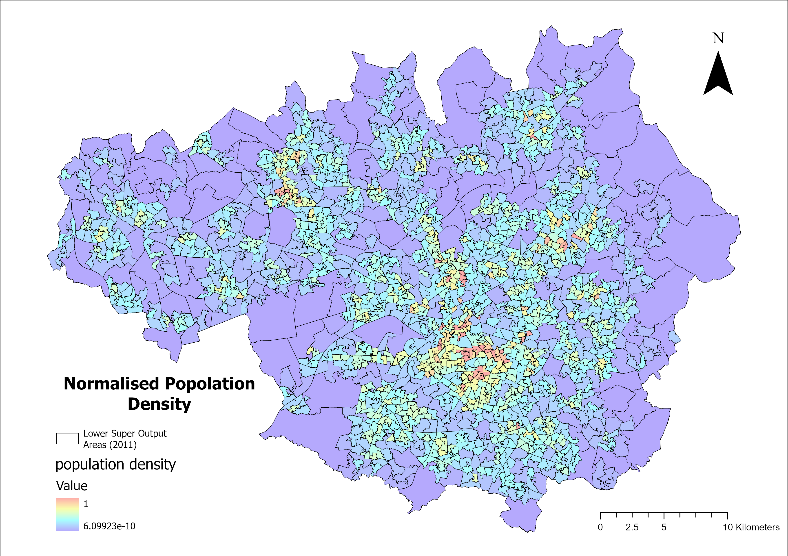
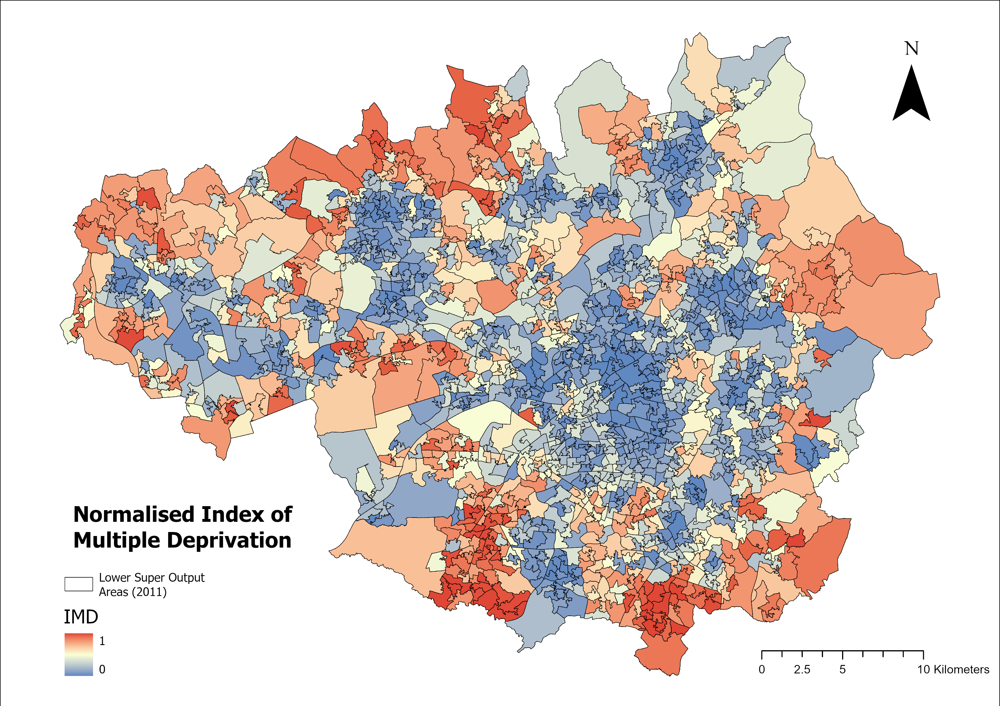
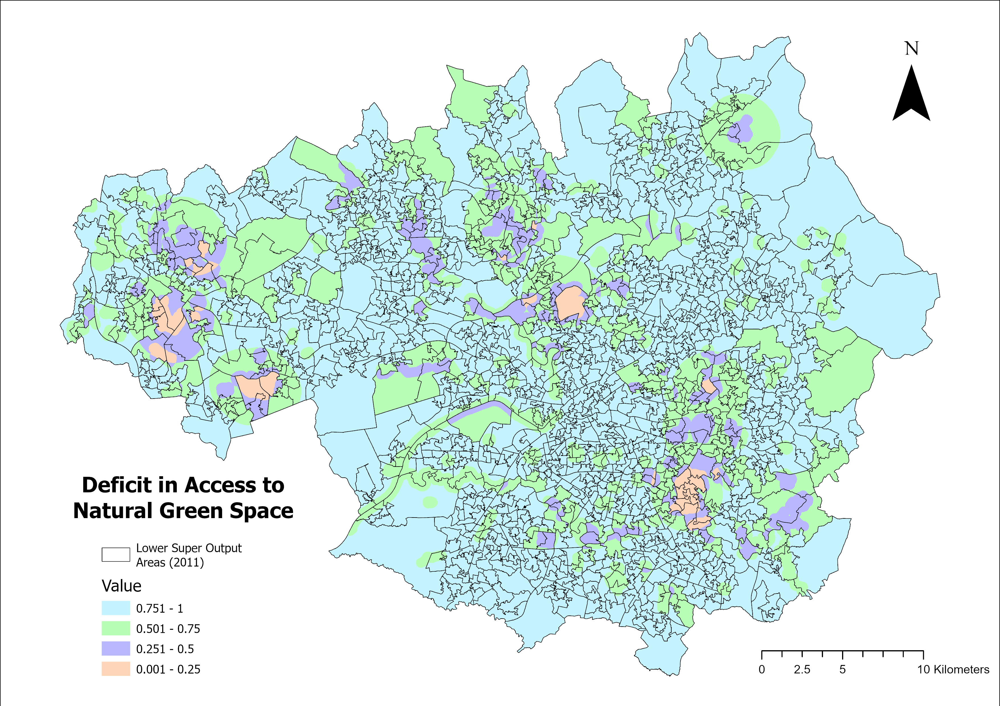
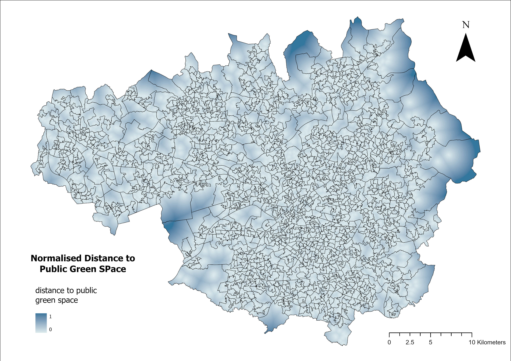
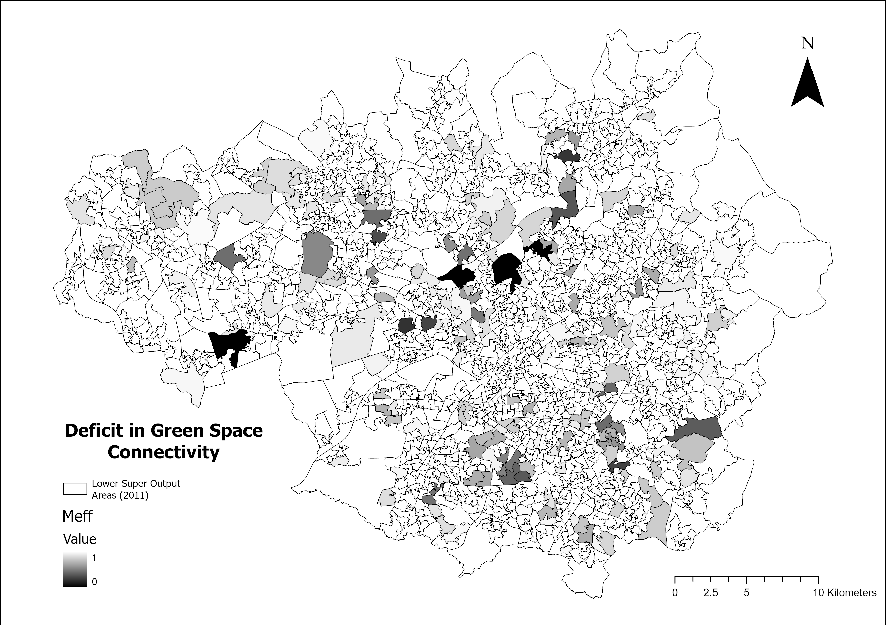

# GIS-Based Site Selection for Green Infrastructure in Greater Manchester

A GIS-based site selection project that identifies priority areas for green infrastructure (GI) interventions in Greater Manchester using Multi-Criteria Evaluation (MCE) and Weighted Linear Combination (WLC).

## Project Overview

In the past years, GI has received growing attention not only for its potential to improve public health and urban climate adaptation but also to alleviate social inequality. This project takes Greater Manchester as the research area and uses GIS-based MCE and WLC methods to systematically identify and evaluate potential green infrastructure intervention sites.

On this basis, the study further designs two types of scenario plans with different planning objectives. One focuses on urban thermal environment regulation and ecological benefits through rooftop greening. The other is the site selection for the largest community garden, oriented towards humanistic and social benefits, aiming to address green space accessibility and social needs at the community level. Through these intervention plans, the study attempts to alleviate social-environmental inequality caused by the uneven distribution of urban green space. 

## Key Results

<h3>Comprehensive suitability map</h3>


The comprehensive suitability map was generated through a weighted combination of six indicators. Higher suitability values were mainly concentrated in the peripheral areas of Greater Manchester, particularly in the southern, northeastern and northwestern parts of the region, while lower suitability values were more commonly observed in the urban core. This pattern suggests that areas with larger socio-environmental deficits and lower access to green space have stronger potential need for GI interventions.

Based on the composite suitability surface, the top 10% of high-suitability areas were identified as priority zones for potential intervention. These areas showed clustered spatial distribution rather than random dispersion, especially in peripheral communities in the southern and eastern parts of Greater Manchester.


Local Moran’s I analysis further showed high spatial consistency between the top-ranked suitability areas and high-high clustering zones, which partially validates the statistical robustness of the identified priority areas.


## Scenario-Based Outputs

### 1. Rooftop garden site selection

<h3>Rooftop garden sites selected</h3>


This scenario overlays comprehensive high-suitability target areas with building outline data at the LSOA scale. The weight of the land surface temperature factor was recalibrated in the WLC process to better reflect the potential benefits that rooftop greening can bring to mitigating thermal environments. This allowed a series of specific building units to be identified as potentially suitable for rooftop GI interventions.

### 2. Largest community garden site selection

<h3>Largest community garden site</h3>


The site selection of community gardens is based on the results of the comprehensive GI suitability analysis and is screened in combination with spatial feasibility and social needs. It first extracts spatial units from the available area for ground greening, then introduces IMD and ANGSt to preferentially identify areas with high social needs and insufficient green space supply. Finally, it screens candidate plots in conjunction with land use type and plot scale, selecting medium-sized plots as demonstration sites for community gardens.

## Method

The project uses Multi-Criteria Evaluation / Weighted Linear Combination (MCE/WLC) to integrate multiple indicators into a composite suitability surface for planning decision-support. The workflow also includes Local Moran’s I analysis to test whether the resulting suitability pattern shows meaningful spatial clustering rather than random distribution. 


### Key indicators

A total of six factors were selected for weighting and used to calculate the overall suitability:

- Population density

<h3>Population density</h3>

  
- Index of Multiple Deprivation (IMD)
  
<h3>IMD</h3>

  
- Normalised Difference Vegetation Index (NDVI)
  
<h3>NDVI</h3>

  
- Accessible Natural Greenspace Standard(ANGSt)-based green space accessibility deficit

<h3>ANGSt</h3>


- Distance to public green space
  
<h3>Distance to public green space</h3>


- Green space patch connectivity (effective mesh size, Meff)
<h3>Meff</h3>



### Why these factors were used

**Social needs and equity**  
The IMD is the UK government's official composite measure of socioeconomic vulnerability, reflecting multiple disadvantages including income, health, education, and living conditions. For less mobile groups such as the elderly or low-income individuals, reliance on green spaces near their residences is even greater. In these areas of heightened social vulnerability, the absence of accessible, high-quality public green spaces exacerbates chronic health risks like obesity, depression, and cardiovascular disease. Furthermore, these populations are more susceptible to climate change threats (e.g., heatwaves), and the lack of green spaces further amplifies their health risks (Dennis et al., 2020). Simultaneously, population density serves as a measure of the potential beneficiary population for green space development, making it a crucial indicator for maximizing the social benefits of green infrastructure interventions.

Therefore, in this study, IMD was selected as the primary weighting factor for the social dimension, assigned a weight of 0.3. High population density values represent the intensity of intervention demand, serving as a secondary factor for the social dimension with a weight of 0.1.

**Spatial accessibility and coverage**  
ANGSt and distance to public green factors were considered.
ANGSt is a widely adopted UK government standard for assessing natural green space accessibility planning, explicitly stipulating that residents should have access to natural green spaces of varying sizes under the following conditions:

People must have an accessible natural greenspace: of at least 2 hectares in size, no more than 300 meters (5 minutes walk) from home; at least one accessible 20-hectare site within two kilometers of home; one accessible 100-hectare site within five kilometers of home; and one accessible 500-hectare site within ten kilometers of home; plus a minimum of one hectare of statutory Local Nature Reserves per thousand population. (Natural England, 2010)

Access to public greenspace further emphasizes the universality and multifunctionality of green space services. Therefore, in this study, ANGSt most directly reflects whether service provision meets standards. As the core factor in the accessibility dimension, it is assigned a weight of 0.2. Distance to Public Green, serving as an auxiliary factor, is assigned a weight of 0.1.

**Ecological quality**  
Research indicates that in certain communities, fragmented green spaces characterized by “proximity but small size and poor quality” fail to deliver health and ecological benefits comparable to those of large or connected green spaces (Dennis et al., 2020). 

So this assessment takes NDVI as the primary indicator with a weighting of 0.2 to measure existing vegetation growth conditions and ecological service capacity, using the following algorithm:

$$
NDVI = \frac{\rho_{NIR} - \rho_{Red}}{\rho_{NIR} + \rho_{Red}}
$$

Green space connectivity was quantified by the effective mesh size (Meff), which represents the size of an equivalent continuous green space and can be interpreted as the probability that two randomly chosen points fall within the same patch, multiplied by the total landscape area (Dennis et al., 2020). In practice, Meff was calculated as:

$$
m_{eff} = \frac{1}{A} \sum_{i=1}^{n} a_i^2
$$

where A is the total area of the LSOA and ai denotes the area of individual green space patches.
Meff measures the degree of green space fragmentation and serves as a supplementary indicator for green space structure and quality, with a weight of 0.1.

**Additional scenario-specific factor**  
For the rooftop greening scenario, Land Surface Temperature (LST) was additionally considered to better reflect the potential of GI for urban heat island mitigation. LST data were derived from Landsat 9 imagery for Greater Manchester from June to August.

## Data Sources

The spatial datasets used in this project were obtained from a combination of UK open data sources and satellite-derived products. Administrative boundary and socio-economic data, including LSOA and IMD, were sourced from the Office for National Statistics (ONS). Public green space and natural site information were derived from Ordnance Survey Open Greenspace and Natural England datasets. In addition, near-infrared and red band imagery were derived from Copernicus Sentinel-2, while land surface temperature data were exported from Google Earth Engine.


## Limitations

This project has several limitations.

First, weight allocation relies to some extent on the researcher’s subjective judgment. In particular, ANGSt and distance to public green space are theoretically distinct but still have some conceptual overlap, which may affect the final suitability outcomes.

Second, the datasets used are not fully temporally consistent. For example, Local Nature Reserve and Open Greenspace data are from October 2025, while IMD data are from 2019 and population data rely on the ONS 2011 Census. This temporal mismatch may affect the accuracy and real-world applicability of the results.

Third, the original Landsat LST data had a spatial resolution of 30 m and were resampled to 10 m to match other raster layers such as NDVI. Although this improves consistency across layers, it may reduce the authenticity of local temperature variation.

## Planning Implications

Ground-truthing is necessary when applying this kind of GIS-based planning analysis in practice. In addition, future work could consider the dilution effect of large private and institutional green spaces on public green space demand, as well as topographic impedance, since simple Euclidean distance does not fully represent real accessibility in hilly landscapes. Future planning could also consider per capita green space exposure analysis for specific demographic groups.

## Repository Structure

```text
project/
├── data/                # input data or sample/derived data if allowed
├── maps/                # final maps used in the project
├── figures/             # workflow charts, result figures, screenshots
├── docs/                # original report or supplementary write-up
├── scripts/             # ArcGIS / GEE / processing scripts if available
└── README.md
```
## Acknowledgements

Contains Ordnance Survey data © Crown copyright and database right (2024). Other datasets were obtained from UK Government Open Data, Copernicus Sentinel-2, and Google Earth Engine.

## References
Dennis, M. et al. (2020) ‘Relationships between health outcomes in older populations and urban green infrastructure size, quality and proximity’, BMC Public Health, 20(1), p. 626. Available at: https://doi.org/10.1186/s12889-020-08762-x.

Dennis, M., Armitage, R.P. and James, P. (2016) ‘Appraisal of social-ecological innovation as an adaptive response by stakeholders to local conditions: Mapping stakeholder involvement in horticulture orientated green space management’, Urban Forestry & Urban Greening, 18, pp. 86–94. Available at: https://doi.org/10.1016/j.ufug.2016.05.010.

Drobne, S. and Lisec, A. (no date) ‘Multi-attribute Decision Analysis in GIS: Weighted Linear Combination and Ordered Weighted Averaging’.
